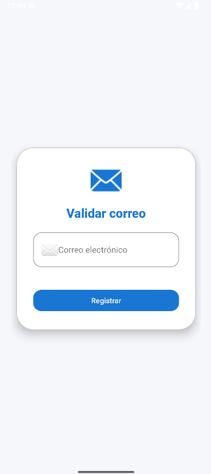

# AM_S12ValidarCorreo

# Validador de Correos en Tiempo Real


> **Proyecto Android – Kotlin (SDK 25)** que demuestra cómo validar en tiempo real la disponibilidad de un correo electrónico usando **Firebase Authentication** y **LiveData**. Ideal como práctica universitaria o como semilla para apps más grandes.

---

## Tabla de Contenidos

1. [Descripción](#descripción)
2. [Tecnologías](#tecnologías)
3. [Arquitectura](#arquitectura)
4. [Instalación y configuración](#instalación-y-configuración)
5. [Cómo funciona la validación en tiempo real](#cómo-funciona-la-validación-en-tiempo-real)
6. [Capturas de pantalla](#capturas-de-pantalla)

---

## Descripción

Esta app muestra un *card* elegante con un campo de correo electrónico. Mientras el usuario escribe, **LiveData** observa los cambios y consulta **Firebase** para saber si ese correo:

* ✨ **Está disponible** → muestra mensaje verde, habilita el botón «Registrar».
* ❌ **Ya está registrado** o el formato es incorrecto → muestra mensaje rojo, deshabilita el botón.

Todo ocurre **sin recargar la pantalla** y con un feedback visual claro.

## Tecnologías

| Herramienta         | Versión | Uso                          |
| ------------------- | ------- | ---------------------------- |
| Android SDK         |  25–36  | Compatibilidad min/max       |
| Kotlin              |  1.9.x  | Lenguaje principal           |
| Firebase BoM        | 32.7.0  | Manejo de versiones Firebase |
| Firebase Auth KTX   |         | Validación de email          |
| AndroidX Lifecycle  |  2.7.0  | LiveData & ViewModel         |
| Material Components | 1.12.x  | UI moderna                   |

## Arquitectura

```
MainActivity <-observa-> MainViewModel <-usa-> FirebaseAuth
            (ViewBinding)              (LiveData)
```

* **MVVM**: clara separación UI ↔ lógica.
* **ViewBinding**: acceso seguro a vistas.
* **ConstraintLayout + MaterialCardView**: diseño responsivo y atractivo.

## Instalación y configuración

1. **Clona** este repositorio:

   ```bash
   git clone https://github.com/PieroL1/AM_S12ValidarCorreo.git
   ```
2. Abre el proyecto en **Android Studio** (Giraffe o superior).
3. Copia tu `google-services.json` dentro de `app/`.
4. En la **Consola de Firebase**: habilita **Email/Password** en *Authentication → Sign‑in method*.
5. Sincroniza Gradle y ejecuta en un emulador o dispositivo físico (Android 5.0+).

## Cómo funciona la validación en tiempo real

1. El usuario escribe en `TextInputEditText`.
2. Un **TextWatcher** notifica al **ViewModel**.
3. `FirebaseAuth.fetchSignInMethodsForEmail()` comprueba el correo.
4. El resultado se emite por **LiveData** y la actividad actualiza:

   * Texto de estado.
   * Estado habilitado del botón.

Diagrama de flujo rápido:

```
Usuario → EditText → ViewModel → Firebase → ViewModel → LiveData → UI
```

## Capturas de pantalla

| Pantalla vacía                        | Correo válido                         |
| ------------------------------------- | ------------------------------------- |
|  |  |


